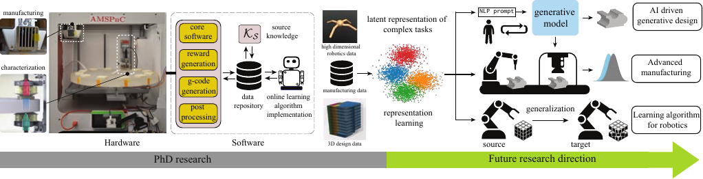

```{r setup, include=FALSE}
knitr::opts_chunk$set(echo = FALSE)
```

|  | University| Topic | Deadline | Remarks | Link | Status | Materials|
|--------|----------|-------|----------|---------|--------|------|-------|
| 1 | Texas Tech (ME)| Compy Sci, ML, AI | Sep 1/open | Donald Docimo | [Link](https://www.depts.ttu.edu/me/department/open_positions.php) | $\sim$| [](https://drive.google.com/drive/folders/1KVZIyn0PnywHl6CU1vqnssU4hPfWLxkE?usp=sharing)|
| 2 | SUNNY Binghamton (SSIE)| Autonomous systems | Nov 1/open | - | [Link]() | $\sim$| [](https://drive.google.com/drive/folders/1elDxTa6AVuseV0fpLrDMGTo8_sGJ3T4u?usp=sharing)|
| 3 | NC State (ISE)| next gen Mfg, robotics | Nov 1/open | - | [Link]() | $\sim$| [](http://google.com)|
| 4 | Clemson (ME)| AI/ML, control, robotics | Sep 30/open | - | [Link](https://apply.interfolio.com/102152?source=JobTarget) | $\sim$| [](https://drive.google.com/drive/folders/15Tkb801gHWj-lMJAb617GvdT2I4FGlf-?usp=sharing)|
| 5 | Iowa State (ME)| ML, computational | Oct 1/open | - | [Link](https://isu.wd1.myworkdayjobs.com/en-US/IowaStateJobs/details/Mechanical-Engineering-Computational-Sciences---Assistant-Associate-Full-Professor_R9077?q=mechanical&)| $\sim$ | [](https://drive.google.com/drive/folders/1Qjb4QZFem__BIOf3Dlw7hz8X00TknOxn?usp=sharing)|
| 6 | UT Austin (ME)| Mfg, Control, robotics | Nov 1 | - | [Link](https://www.me.utexas.edu/people/faculty-jobs) |$\sim$| [](https://drive.google.com/drive/folders/1qRaopZu_5XeYXzz8b1Sz_thqd4yMkEwW?usp=sharing)|
| 7 | UMich (ME) | Control, Mfg | Nov 1 | - | [Link](https://me.engin.umich.edu/about/positions/faculty/) | $\sim$| [](https://drive.google.com/drive/folders/1JRKS5mpGzz_guc45Dyf4IbvrDmo9vBbq?usp=sharing)|
| 8 | Texas A&M (ME) | Control, robotics, mechatronics | Nov 1 | - | [Link](https://apply.interfolio.com/112478) | $\sim$| [](https://drive.google.com/drive/folders/1QoN9k-Ga_Pp2etkaC7bd59uQ56EWuvtr?usp=sharing)|
| 9 | Carnegie Mellon (ME) | Control, robotics, AI/ML | Nov 1 | - | [Link](https://www.meche.engineering.cmu.edu/employment.html) | $\sim$| [](http://google.com)|
| 10 | Notre Dame (ME)| Robotics, Mfg, Data Sci | Nov 4/Dec 1 | - |[Link](https://apply.interfolio.com/112134) | $\sim$| [](https://drive.google.com/drive/folders/1tBV59Xem08EvDfIdGcsN2ptBDeicOJW2?usp=sharing)|
| 11 | Arizona State (ME)| Control, Autonomous, robotics | Nov 5 | - | [Link](https://apply.interfolio.com/113817) | $\sim$| [](https://drive.google.com/drive/folders/1OAWBKNQpPMdOdFl6bT6mVGRic-7laGNn?usp=sharing)|
| 12 | Northwestern (ME) | Mfg, data analytics, Mfg optiization | Nov 15 | - | [Link](https://www.mccormick.northwestern.edu/mechanical/careers/) | $\sim$| [](https://drive.google.com/drive/folders/1Vg1CeXyTtgQadFfa7q2TZWNf_fL0q4y6?usp=sharing)|
| 13 | Boston University (ME) | Mfg, robotics, autonomous, data science, design| Nov 21/Dec 16 | - | [Link](https://www.bu.edu/eng/departments/me/open-faculty-positions/#ASSISTANT%20PROFESSOR%20IN%20EMERGING%20AREAS) | $\sim$| [](https://drive.google.com/drive/folders/1eK4-ZdkZOuosI69_G4QcYmOouP3npXIt?usp=sharing)|
| 14 | Oregon State (ME) | Mfg, Control, AI, robotics, mechatronics | Dec 1 | - | [Link](https://jobs.oregonstate.edu/postings/125513) | $\sim$| [](https://drive.google.com/drive/folders/1eyT9BXElHdIpBf23ZGsbVXeBDl7mfuq4?usp=sharing)|
| 15 | Columbia (ME)| Autonomous systems, Desin and Mfg, Robotics | Dec 1 | - | [Link](https://apply.interfolio.com/114276) | $\sim$| [](https://www.engineering.columbia.edu/faculty-job-opportunities#me)|
| 16 | UC Berkeley (ME) | AI design, ML, Mfg | Dec 12 | - | [Link](https://aprecruit.berkeley.edu/JPF03635) | $\sim$|[](https://drive.google.com/drive/folders/1MQKITL9W8rooxQqnl6rwLebXQKU-EYT-?usp=sharing)|
| 17 | UT Dallas (ME)| Design, Mfg, Automation, robotics | Oct 31/Dec 31 | Justin Koeln | [Link](https://jobs.utdallas.edu/postings/20919) | $\sim$| [](https://drive.google.com/drive/folders/1oYR1_clPlpMJoq_iF41OmYlnL21qgTvF?usp=sharing)|
| 18 | Rice (ME)| Design, Control, robotics | Dec 31 | - | [Link](https://apply.interfolio.com/114276) | $\sim$| [](https://drive.google.com/drive/folders/1aLWNHjJ5-j2L6iJRqjQLK2GSpna8vHLD?usp=sharing)|
| 19 | UW Madison (ME)| Autonomous systems, Mfg, Learning | Jan 12 | - | [Link](https://apply.interfolio.com/114276) | $\sim$| [](https://jobs.hr.wisc.edu/cw/en-us/job/515799/assistant-professor)|


<br/><br/>

### Ferdous past research and future reserach plans:



